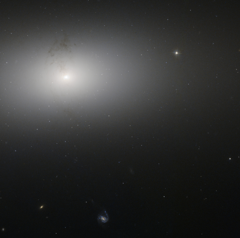

# Preview of potw1314a: "Dusty detail in elliptical galaxy NGC 2768"
[https://www.spacetelescope.org/images/potw1314a/](https://www.spacetelescope.org/images/potw1314a/)

The  soft glow in the picture above is NGC 2768, an elliptical galaxy  located in the northern constellation of Ursa Major (The Great Bear). It  appears here as a bright oval on the sky, surrounded by a  wide, fuzzy cloud of material. This image, taken by the NASA/ESA Hubble  Space Telescope, shows the dusty structure encircling the centre of the  galaxy, forming a knotted ring around the galaxy’s brightly  glowing middle. Interestingly, this ring lies perpendicular to the plane  of NGC 2768 itself, stretching up and out of the galaxy. The dust in NGC  2768 forms an intricate network  of knots and filaments. In the centre of the galaxy are  two tiny, S-shaped symmetric jets. These two flows of material travel  outwards from the galactic centre along curved paths, and are masked by the tangle of dark dust lanes that spans the body of the  galaxy. These  jets are a sign of a very active centre. NGC 2768 is an example of a  Seyfert galaxy, an object with a supermassive black hole at its centre.  This speeds up and sucks in gas from the nearby space, creating a stream  of material swirling inwards towards the black hole known as an  accretion disc. This disk throws off material in very energetic  outbursts, creating structures like the jets seen in the image above. A  version of this image was entered into the Hubble's Hidden Treasures image processing competition by contestant Judy Schmidt. One of her  images, of newborn star XZ Tauri, was awarded third prize.