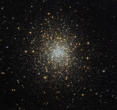

# Preview of potw1315a: "A unique cluster: one of the hidden 15"
[https://www.spacetelescope.org/images/potw1315a/](https://www.spacetelescope.org/images/potw1315a/)

Globular  clusters are relatively common in our sky, and generally look similar.  However, this image, taken using the NASA/ESA Hubble Space Telescope,  shows a unique example of such a cluster — Palomar 2. Palomar  2 is part of a group of 15 globulars known as the Palomar clusters.  These clusters, as the name suggests, were discovered in survey plates  from the first Palomar Observatory Sky Survey in the 1950s, a project  that involved some of the most well-known astronomers of the day,  including Edwin Hubble. They were discovered quite late because they are  so faint — each is either extremely remote, very heavily hidden behind  blankets of dust, or has a very small number of remaining stars. This  particular cluster is unique in more than one way. For one, it is the  only globular cluster that we see in this part of the sky, the northern  constellation of Auriga (The Charioteer). Globular clusters orbit the  centre of a galaxy like the Milky Way in the same way that satellites  circle around the Earth. This means that they normally lie closer in to  the galactic centre than we do, and so we almost always see them in the  same region of the sky. Palomar 2 is an exception to this, as it is  around five times further away from the centre of the Milky Way than  other clusters. It also lies in the opposite direction — further out  than Earth — and so it is classed as an “outer halo” globular. It  is also unusual due to its brightness. The cluster is veiled by a mask  of dust, dampening the apparent brightness of the stars within it and  making it appear as a very faint burst of stars. The  stunning NASA/ESA Hubble Space Telescope image above shows Palomar 2 in a  way that could not be captured from smaller or ground-based telescopes —  some amateur astronomers with large telescopes attempt to observe all of the obscure and  well-hidden Palomar 15 as a challenge, to see how many they can pick out  from the starry sky.