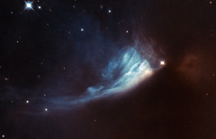

# Preview of potw1316a: "A changing fan"
[https://www.spacetelescope.org/images/potw1316a/](https://www.spacetelescope.org/images/potw1316a/)

The Universe is rarely static, although the timescales involved can be very long. Since modern astronomical observations began we have been observing the birthplaces of new stars and planets, searching for and studying the subtle changes that help us to figure out what is happening within. The bright spot located at the edge of the bluish fan-shaped structure in this Hubble image is a young star called V* PV Cephei, or PV Cep. It is a favourite target for amateur astronomers because the fan-shaped nebulosity, known as GM 1-29 or Gyulbudaghian’s Nebula, changes over a timescale of months. The brightness of the star has also varied over time. Images of PV Cep taken in 1952 showed a nebulous streak, similar to a comet’s tail. However, these had vanished when new images of the star were obtained some twenty-five years later. Instead, the blue fan-shaped nebula had appeared. Twenty-five years is a very short period on cosmic timescales, so astronomers think that the mysterious streak may have been a temporary phenomenon, such as the remnants of a massive stellar flare — similar to the solar flares we are used to seeing in the Solar System. At the same time as this was happening, the star itself was brightening. This provided the light to illuminate the newly formed fan-shaped nebula. This brightening might be related to the start of the hydrogen-burning phase of the star, which would mean that it was reaching maturity. PV Cep is thought to be surrounded by a disc of gas and dust, which would stop light from escaping in all directions. The fan-like appearance is therefore probably a result of starlight escaping from the dust disc and projecting onto the nebula. PV Cep is located in the northern constellation of Cepheus at a distance of over 1600 light-years from Earth. A version of this image was entered into the Hubble’s Hidden Treasures competition by contestant Alexey Romashin.