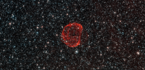

# Preview of potw1317a: "The remains of a star gone supernova"
[https://www.spacetelescope.org/images/potw1317a/](https://www.spacetelescope.org/images/potw1317a/)

These delicate wisps of gas make up an object known as SNR B0519-69.0, or SNR 0519 for short. The thin, blood-red shells are actually the remnants from when an unstable progenitor star exploded violently as a supernova around 600 years ago. There are several types of supernova, but for SNR 0519 the star that exploded is known to have been a white dwarf star — a Sun-like star in the final stages of its life. SNR 0519 is located over 150 000 light-years from Earth in the southern constellation of Dorado (The Dolphinfish), a constellation that also contains most of our neighbouring galaxy the Large Magellanic Cloud (LMC). Because of this, this region of the sky is full of intriguing and beautiful deep sky objects. The LMC orbits the Milky Way galaxy as a satellite and is the fourth largest in our group of galaxies, the Local Group. SNR 0519 is not alone in the LMC; the NASA/ESA Hubble Space Telescope also came across a similar bauble a few years ago in SNR B0509-67.5, a supernova of the same type as SNR 0519 with a strikingly similar appearance. A version of this image was submitted to the Hubble’s Hidden Treasures Image Processing Competition by Claude Cornen, and won sixth prize.