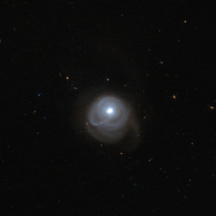

# Preview of potw1318a: "A tale of galactic collisions"
[https://www.spacetelescope.org/images/potw1318a/](https://www.spacetelescope.org/images/potw1318a/)

When  we look into the distant cosmos, the great majority of the objects we  see are galaxies: immense gatherings of stars, planets, gas, dust, and  dark matter, showing up in all kind of shapes. This Hubble picture  registers several, but the galaxy catalogued as 2MASX J05210136-2521450  stands out at a glance due to its interesting shape. This  object is an ultraluminous infrared galaxy which emits a tremendous  amount of light at infrared wavelengths. Scientists connect this to intense star formation activity, triggered by a collision between two  interacting galaxies. The  merging process has left its signs: 2MASX J05210136-2521450 presents a  single, bright nucleus and a spectacular outer structure that consists  of a one-sided extension of the inner arms, with a tidal tail heading in  the opposite direction, formed from material ripped out from the  merging galaxies by gravitational forces. The image is a combination of exposures taken by Hubble’s Advanced Camera for Surveys, using near-infrared and visible light. A version of this image was submitted to the Hubble’s Hidden Treasures image processing competition by contestant Luca Limatola.