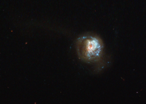

# Preview of potw1320a: "A swirl of star formation"
[https://www.spacetelescope.org/images/potw1320a/](https://www.spacetelescope.org/images/potw1320a/)

This  beautiful, glittering swirl is named, rather unpoetically,  J125013.50+073441.5. A glowing haze of material seems to engulf the  galaxy, stretching out into space in different directions and forming a  fuzzy streak in this image. It is a starburst galaxy — a name given to  galaxies that show unusually high rates of star formation. The regions  where new stars are being born are highlighted by sparkling bright blue  regions along the galactic arms. Studying  starburst galaxies can tell us a lot about galactic evolution and star  formation. These galaxies start off with huge amounts of gas, which is  used to form new stars. This period of furious star formation is only a  phase; once all the gas is used up, this starbirth slows down. Other  famous starbursts captured by Hubble include the Antennae Galaxies and Messier 82, the latter of which is forming new stars ten times faster than our galaxy, the Milky Way. The data for this image were collected as part of a study named LARS (Lyman Alpha Reference Sample) [1], which is investigating the interaction between radiation and  matter in relatively nearby starburst galaxies. J125013.50+073441.5 is  included as one of its fourteen targets.  This study has characterised how a certain type of emission known as  Lyman-alpha emission interacts with nearby gas, affecting how it travels  out into space. The data for this image were collected using Hubble’s Wide Field Camera 3. More information [1] Hayes, Östlin et al., The Lyman Alpha Reference Sample: extended Lyman alpha halos produced at low dust content, The Astrophysical Journal, 2013.