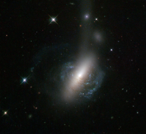

# Preview of potw1321a: "The messy result of a galactic collision"
[https://www.spacetelescope.org/images/potw1321a/](https://www.spacetelescope.org/images/potw1321a/)

This  new image from the NASA/ESA Hubble Space Telescope captures an  ongoing cosmic collision between two galaxies — a spiral galaxy is in  the process of colliding with a lenticular galaxy. The collision looks  almost as if it is popping out of the screen in 3D, with parts of the  spiral arms clearly embracing the lenticular galaxy’s bulge. The  image also reveals further evidence of the collision. There is a bright  stream of stars coming out from the merging galaxies, extending out  towards the right  of the image. The bright spot in the middle of the plume, known as ESO  576-69, is what makes this image unique. This spot is believed to be the  nucleus of the former spiral galaxy, which was ejected from the system  during the collision and is now being shredded by tidal forces to  produce the visible stellar stream. A version of this image was entered into the Hubble’s Hidden Treasures image processing competition by contestant Luca Limatola.