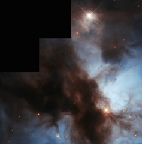

# Preview of potw1322a: "NGC 1579: The Trifid of the North"
[https://www.spacetelescope.org/images/potw1322a/](https://www.spacetelescope.org/images/potw1322a/)

Unlike the venomous fictional plants that share its name, the Trifid of the North, otherwise known as the  Northern Trifid or NGC 1579, poses no threat to your vision. The  nebula’s moniker is inspired by the better-known Messier 20, the Trifid  Nebula, which lies very much further south in the sky and displays  strikingly similar swirling clouds of gas and dust. The  Trifid of the North is a large, dusty region that is currently forming  new stars. These stars are very hot and therefore appear to be very  blue. During their short lives they radiate strongly into the gas  surrounding them, causing it to glow brightly. Many regions like the  Trifid of the North — named H II regions — are clumpy and strangely  shaped due to the powerful winds emanating from the stars within them. H  II regions also have relatively short lives, furiously forming baby  stars until the immense winds from these bodies blow the gas and dust  away, leaving just stars behind. The image above, captured by the NASA/ESA Hubble Space Telescope, shows the bright body of the nebula, with dark dust lanes snaking across the frame. The Trifid of the North glows strongly due to the many stars within it, like young binary EM* LkHA 101. Visible to the bottom right of the image, this binary is thought to be surrounded by a hundred or so fainter and less massive stars, making up a recently formed cluster. It lies behind a cloud of dust so thick that it is almost invisible to astronomers at optical wavelengths. Infrared imaging has now penetrated this dusty veil and is uncovering the secrets of this binary star, which is about five thousand times brighter than our own Sun. A version of this image by Bruno Conti was entered into the Hubble’s Hidden Treasures competition.