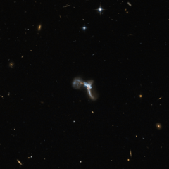

# Preview of potw1323a: "A very bright contortionist"
[https://www.spacetelescope.org/images/potw1323a/](https://www.spacetelescope.org/images/potw1323a/)

The  contorted object captured by Hubble in this picture is IRAS 22491-1808,  also known as the South America Galaxy. It is an ultraluminous infrared  galaxy (ULIRG) that emits a huge amount of light at infrared  wavelengths. The reason for this intense infrared emission lies in an  episode of strong star formation activity, which was set off by a  collision between two interacting galaxies.  In  this image the twisted shape hides a number of features. In the central  region, which is very complex and disturbed, scientists have been able  to distinguish two nuclei, remains of the two different galaxies that  are currently colliding to form a new one. IRAS 22491-1808 is amongst  the most luminous of these types of galaxies, and is considered to be  mid-way through its merging stage. The  centre of this appealing object also shows several intense star-forming  knots which, as seen in the picture, actually  outshine the nuclei in optical wavelengths. To pick out the two merging  nuclei in IRAS 22491-1808, scientists have had to observe it in infrared  wavelengths, where they are more distinct. Other  traces of the galactic collision are the three very noticeable tails in  the image — two linear and one circular.  The tail extending towards the bottom of the image from the main body exhibits a red clump of star formation at its base.