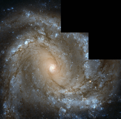

# Preview of potw1324a: "Messier 61 looks straight into the camera"
[https://www.spacetelescope.org/images/potw1324a/](https://www.spacetelescope.org/images/potw1324a/)

The  NASA/ESA Hubble Space Telescope has captured this image of nearby spiral galaxy Messier 61, also known as NGC 4303. The galaxy,  located only 55 million light-years away from Earth, is roughly the size  of the Milky Way, with a diameter of around 100 000 light-years. The  galaxy is notable for one particular reason — six supernovae have been  observed within Messier 61, a total that places it in the top handful of  galaxies alongside Messier 83, also with six, and NGC 6946, with a  grand total of nine observed supernovae. In  this Hubble image the galaxy is seen face-on as if posing for a  photograph, allowing us to study its structure closely. The spiral arms  can be seen in stunning detail, swirling inwards to the very centre of  the galaxy, where they form a smaller, intensely bright spiral. In the  outer regions, these vast arms are sprinkled with bright blue regions  where new stars are being formed from hot, dense clouds of gas. Messier  61 is part of the Virgo Galaxy Cluster, a massive group of galaxies in  the constellation of Virgo (the Virgin). Galaxy clusters, or groups of  galaxies, are among the biggest structures in the Universe to be held  together by gravity alone. The Virgo Cluster contains more than 1300  galaxies and forms the central region of the Local Supercluster, an even  bigger gathering of galaxies. The image was taken using data from Hubble’s Wide Field Camera 2. Different versions of this image were submitted to the Hubble’s Hidden Treasures image processing competition by contestants Gilles Chapdelaine, Luca Limatola, and Robert Gendler. Links   Hubble’s Hidden Treasures  