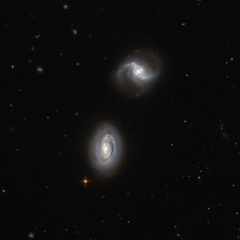

# Preview of potw1325a: "Inseparable galactic twins"
[https://www.spacetelescope.org/images/potw1325a/](https://www.spacetelescope.org/images/potw1325a/)

Looking  towards the constellation of Triangulum (The Triangle), in the northern  sky, lies the galaxy pair MRK 1034. The two very similar galaxies,  named PGC 9074 and PGC 9071, are close enough to one another to be bound  together by gravity, although no gravitational disturbance can yet be  seen in the image. These objects are probably only just beginning to  interact gravitationally. Both  are spiral galaxies, and are presented to our eyes face-on, so we are  able to appreciate their distinctive shapes. On the left of the image,  spiral galaxy PGC 9074 shows a bright bulge and two spiral arms tightly  wound around the nucleus, features which have led scientists to classify  it as a type Sa galaxy. Close by, PGC 9071 — a type Sb galaxy —  although very similar and almost the same size as its neighbour, has a  fainter bulge and a slightly different structure to its arms: their  coils are further apart. The  spiral arms of both objects clearly show dark patches of dust  obscuring the light of the stars lying behind, mixed with bright blue clusters of hot, recently-formed stars. Older, cooler  stars can be found in the glowing, compact yellowish bulge towards the  centre of the galaxy. The whole structure of each galaxy is surrounded  by a much fainter round halo of old stars, some residing in globular  clusters. Gradually,  these two neighbours will attract each other, the process of star  formation will be increased and tidal forces will throw out long tails  of stars and gas. Eventually, after maybe hundreds of millions of years,  the structures of the interacting galaxies will merge together into a  new, larger galaxy. The  images combined to create this picture were captured by Hubble's Advanced  Camera for Surveys (ACS). A version of this image was  submitted to the Hubble’s Hidden Treasures image processing competition by Judy Schmidt.  