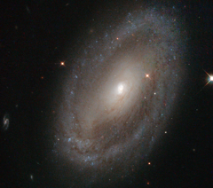

# Preview of potw1326a: "Stalking our celebrity neighbours"
[https://www.spacetelescope.org/images/potw1326a/](https://www.spacetelescope.org/images/potw1326a/)

This is the spiral galaxy NGC 3185, located some 80 million light-years away from us in the constellation of Leo (The Lion). The image shows the galaxy’s spiral arms, which can be traced from the centre of the galaxy out towards the rim, where they appear to meet a sparkling blue disc. At the centre of NGC 3185 is a small but very bright nucleus containing a supermassive black hole. Black holes like this one can have masses many thousands of times that of the Sun, and they become active when matter falls towards them. When this happens the black hole lights up, sending away streams of particles and radiation at almost the speed of light. NGC 3185 is a member of a small, four-galaxy group called Hickson 44, which has a celebrity in its midsts — the group is also home to another spiral galaxy called NGC 3190. NGC 3190 may be very familiar to you; the technology giant Apple Inc. used a blue-tinted image of it as a desktop image for one of its operating systems. These data were unearthed from the NASA/ESA Hubble Space Telescope Legacy Archive by contestant Judy Schmidt, who entered a version of this image into the Hubble’s Hidden treasures image processing competition.