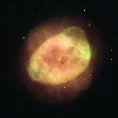

# Preview of potw1327a: "Stars that go out with a whimper"
[https://www.spacetelescope.org/images/potw1327a/](https://www.spacetelescope.org/images/potw1327a/)

This NASA/ESA Hubble Space Telescope  image shows the planetary nebula IC 289, located in the northern  constellation of Cassiopeia. Formerly a star like our Sun, it is now  just a cloud of ionised gas being pushed out into space by the remnants  of the star’s core, visible as a small bright dot in the middle of the  cloud. Weirdly  enough, planetary nebulae have nothing to do with planets. Early  observers, when looking through small telescopes, could only see  undefined, smoky forms that looked like gaseous planets — hence the  name. The term has stuck even though modern telescopes like Hubble have  made it clear that these objects are not planets at all, but the outer  layers of dying stars being thrown off into space. Stars  shine as a result of nuclear fusion reactions in their cores,  converting hydrogen to helium. All stars are stable, balancing the  inward push caused by their gravity with the outwards thrust from the  inner fusion reactions in their cores. When all the hydrogen is consumed  the equilibrium is broken; the gravitational forces become more  powerful than the outward pressure from the fusion process and the core  starts to collapse, heating up as it does so. When  the hot, shrinking core gets hot enough,  the helium nuclei begin to fuse into carbon and oxygen and the collapse  stops. However, this helium-burning phase is highly unstable and huge  pulsations build up, eventually becoming large enough to blow the whole  star’s atmosphere away. A version of this image was entered into the Hubble’s Hidden Treasures image processing competition by contestant Serge Meunier.