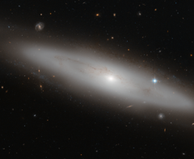

# Preview of potw1328a: "A stranger in the crowd"
[https://www.spacetelescope.org/images/potw1328a/](https://www.spacetelescope.org/images/potw1328a/)

The constellation of Virgo (The Virgin) is the largest of the Zodiac constellations, and the second largest overall after Hydra (The Water Snake). Its most appealing feature, however, is the sheer number of galaxies that lie within it. In this picture, among a crowd of face- and edge-on spiral, elliptical, and irregular galaxies, lies NGC 4866, a lenticular galaxy situated about 80 million light-years from Earth. Lenticular galaxies are somewhere between spirals and ellipticals in terms of shape and properties. From the picture, we can appreciate the bright central bulge of NGC 4886, which contains primarily old stars, but no spiral arms are visible. The galaxy is seen from Earth as almost edge-on, meaning that the disc structure — a feature not present in elliptical galaxies — is clearly visible. Faint dust lanes trace across NGC 4866 in this image, obscuring part of the galaxy’s light. To the right of the galaxy is a very bright star that appears to lie within NGC 4886’s halo. However, this star actually lies much closer to us; in front of the galaxy, along our line of sight. These kinds of perspective tricks are common when observing, and can initially deceive astronomers as to the true nature and position of objects such as galaxies, stars, and clusters. This sharp image of NGC 4866 was captured by the Advanced Camera for Surveys, an instrument on the NASA/ESA Hubble Space Telescope. A version was entered into the Hubble’s Hidden Treasures image processing competition by contestant Gilles Chapdelaine.