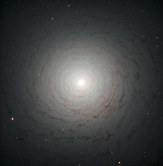

# Preview of potw1329a: "A mysterious old spiral"
[https://www.spacetelescope.org/images/potw1329a/](https://www.spacetelescope.org/images/potw1329a/)

This striking cosmic whirl is the centre of galaxy NGC 524, as seen with the NASA/ESA Hubble Space Telescope. This galaxy is located in the constellation of Pisces, some 90 million light-years from Earth. NGC 524 is a lenticular galaxy. Lenticular galaxies are believed to be an intermediate state in galactic evolution — they are neither elliptical nor spiral. Spirals are middle-aged galaxies with vast, pinwheeling arms that contain millions of stars. Along with these stars are large clouds of gas and dust that, when dense enough, are the nurseries where new stars are born. When all the gas is either depleted or lost into space, the arms gradually fade away and the spiral shape begins to weaken. At the end of this process, what remains is a lenticular galaxy — a bright disc full of old, red stars surrounded by what little gas and dust the galaxy has managed to cling on to. This image shows the shape of NGC 524 in detail, formed by the remaining gas surrounding the galaxy’s central bulge. Observations of this galaxy have revealed that it maintains some spiral-like motion, explaining its intricate structure. A version of this image was entered into the Hubble’s Hidden Treasures image processing competition by contestant Judy Schmidt.