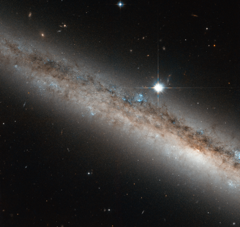

# Preview of potw1330a: "A spiral galaxy crowned by a star"
[https://www.spacetelescope.org/images/potw1330a/](https://www.spacetelescope.org/images/potw1330a/)

Another treasure unearthed from the Hubble archives, this beautiful image shows a spiral galaxy named NGC 4517. Slightly bigger than our Milky Way, it is seen edge-on, crowned by a very bright star. The star is actually much closer to us than the galaxy, explaining why it appears to be so big and bright in the picture.  NGC 4517 is located approximately 40 million light-years away in the constellation of Virgo (The Virgin). It has a bright centre, but this is not visible in this Hubble image. Its orientation has led to it being included in many studies of globular clusters, clumps of stars that orbit the centres of galaxies like satellites. The galaxy was discovered in 1784 by William Herschel, who described this region as having “a pretty bright star situated exactly north of the centre of an extended milky ray”. Of course the “milky ray” seen by Herschel is actually this spiral galaxy, but with his 17th century observing gear he could only tell that there a fuzzy, blurry structure below the much brighter star. This image is composed from visible and infrared light gathered by NASA/ESA Hubble Space Telescope. A version of this image was entered into the Hubble’s Hidden treasures image processing competition by contestant Gilles Chapdelaine.