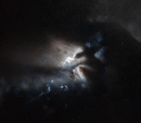

# Preview of potw1331a: "Sunset in Mordor"
[https://www.spacetelescope.org/images/potw1331a/](https://www.spacetelescope.org/images/potw1331a/)

Don’t be fooled by the title; the mysterious, almost mystical bright light emerging from these thick, ominous clouds is actually a telltale sign of star formation. Here, a very young star is being born in the guts of the dark cloud LDN 43 — a massive blob of gas, dust, and ices, gathered 520 light-years from Earth in the constellation of Ophiuchus (The Serpent Bearer). Stars are born from cosmic dust and gas, which floats freely in space until gravity forces it to bind together. The hidden newborn star in this image, revealed only by light reflected onto the plumes of the dark cloud, is named RNO 91. It is what astronomers call a pre-main sequence star, meaning that it has not yet started burning hydrogen in its core. The energy that allows RNO 91 to shine comes from gravitational contraction. The star is being compressed by its own weight until, at some point, a critical mass will be reached and hydrogen, its main component, will begin to fuse together, releasing huge amounts of energy in the process. This will mark the beginning of adulthood for the star. But even before this happens the adolescent star is bright enough to shine and generate powerful stellar winds, emitting intense X-ray and radio emission. RNO 91 is a variable star around half the mass of the Sun. Astronomers have been able to observe the existence of a dusty, icy disc surrounding it, stretching out to over 1700 times the distance from Earth to the Sun. It is believed that this disc may host protoplanets — planets in the process of being formed — and will eventually evolve into a fully-fledged planetary system. This image is based on data gathered by the NASA/ESA Hubble Space Telescope. A version of this image was entered into the Hubble’s Hidden Treasures image processing competition by contestant Judy Schmidt.