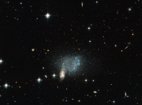

# Preview of potw1332a: "Stars fleeing a cosmic crash"
[https://www.spacetelescope.org/images/potw1332a/](https://www.spacetelescope.org/images/potw1332a/)

Astronomical pictures sometimes deceive us with tricks of perspective. Right in the centre of this image, two spiral galaxies appear to be suffering a spectacular collision, with a host of stars appearing to flee the scene of the crash in a chaotic stampede. However, this is just a trick of perspective. It is true that two spiral galaxies are colliding, but they are millions of light-years away, far beyond the cloud of blue and red stars near the merging spiral. This sprinkling of stars is actually an isolated, irregular dwarf galaxy named ESO 489-056. The dwarf galaxy is actually much more distant than many bright stars in the foreground of the image, which are located much closer to us, in the Milky Way. ESO 489-056 is located 16 million light-years from Earth in the constellation of Canis Major (The Greater Dog), in our local Universe. It is composed of a few billion red and blue stars — a very small number when compared to galaxies like the Milky Way, which is estimated to contain around 200 to 400 billion stars, or the Andromeda Galaxy, which contains a mind-boggling one trillion. A version of this image was entered into the Hubble's Hidden Treasures image processing competition by contestant Luca Limatola.