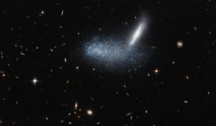

# Preview of potw1333a: "A cosmic optical illusion"
[https://www.spacetelescope.org/images/potw1333a/](https://www.spacetelescope.org/images/potw1333a/)

At first glance, this Hubble picture appears to capture two space colossi entangled in a fierce celestial battle, with two galaxies entwined and merging to form one. But this shows just how easy it is to misinterpret the jumble of sparkling stars and get the wrong impression — as it’s all down to a trick of perspective. By chance, these galaxies appear to be aligned from our point of view. In the foreground, the irregular dwarf galaxy PGC 16389 — seen here as a cloud of stars — covers its neighbouring galaxy APMBGC 252+125-117, which appears edge-on as a streak. This wide-field image also captures many other more distant galaxies, including a quite prominent face-on spiral towards the right of the picture. A version of this image was entered into the Hubble’s Hidden Treasures image processing competition by contestant Luca Limatola.