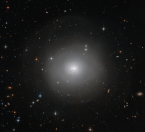

# Preview of potw1334a: "Dark, dusty shells"
[https://www.spacetelescope.org/images/potw1334a/](https://www.spacetelescope.org/images/potw1334a/)

The NASA/ESA Hubble Space Telescope has captured this image of PGC 10922, an example of a lenticular galaxy — a galaxy type that lies on the border between ellipticals and spirals. Seen face-on, the image shows the disc and tightly-wound spiral structures of dark dust encircling the bright centre of the galaxy. There is also a remarkable outer halo of faint wide arcs or shells extending outwards, covering much of the picture. These are likely to have been formed by a gravitational encounter or even a merger with another galaxy. Some dust also appears to have escaped from the central structure and has spread out across the inner shells. An extraordinarily rich background of more remote galaxies can also be seen in the image. A version of this image was entered into the Hubble's Hidden Treasures image processing competition by contestant Judy Schmidt.