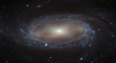

# Preview of potw1335a: "A spiral in the Air Pump"
[https://www.spacetelescope.org/images/potw1335a/](https://www.spacetelescope.org/images/potw1335a/)

Lying over 110 million light-years away from Earth in the constellation of Antlia (The Air Pump) is the spiral galaxy IC 2560, shown here in an image from NASA/ESA Hubble Space Telescope. At this distance it is a relatively nearby spiral galaxy, and is part of the Antlia cluster — a group of over 200 galaxies held together by gravity. This cluster is unusual; unlike most other galaxy clusters, it appears to have no dominant galaxy within it. In this image, it is easy to spot IC 2560's spiral arms and barred structure. This spiral is what astronomers call a Seyfert-2 galaxy, a kind of spiral galaxy characterised by an extremely bright nucleus and very strong emission lines from certain elements — hydrogen, helium, nitrogen, and oxygen. The bright centre of the galaxy is thought to be caused by the ejection of huge amounts of super-hot gas from the region around a central black hole. There is a story behind the naming of this quirky constellation — Antlia was originally named antlia pneumatica by French astronomer Abbé Nicolas Louis de Lacaille, in honour of the invention of the air pump in the 17th century. A version of this image was entered into the Hubble's Hidden Treasures image processing competition by contestant Nick Rose.