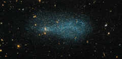

# Preview of potw1336a: "A flock of stars"
[https://www.spacetelescope.org/images/potw1336a/](https://www.spacetelescope.org/images/potw1336a/)

The glittering specks in this image, resembling a distant flock of flying birds, are the stars that make up the dwarf galaxy ESO 540-31. Captured in this new image from the NASA/ESA Hubble Space Telescope, the dwarf galaxy lies just over 11 million light-years from Earth, in the constellation of Cetus (The Whale). The background of this image is full of many other galaxies, all located at vast distances from us. Dwarf galaxies are the among the smaller and dimmer members of the galactic family, typically only containing around a few hundred million stars. Although this sounds like a large number, it is small when compared to spiral galaxies like our Milky Way, which are made up of hundreds of billions of stars. A version of this image was entered into the Hubble’s Hidden Treasures image processing competition by contestant Luca Limatola.