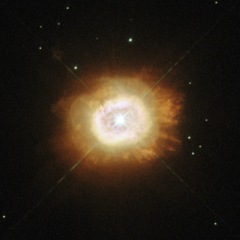

# Preview of potw1337a: "A smouldering star"
[https://www.spacetelescope.org/images/potw1337a/](https://www.spacetelescope.org/images/potw1337a/)

This new image, snapped by NASA/ESA Hubble Space Telescope, shows the star HD 184738, also known as Campbell’s hydrogen star. It is surrounded by plumes of reddish gas — the fiery red and orange hues are caused by glowing gases, including hydrogen and nitrogen.HD 184738 is at the centre of a small planetary nebula. The star itself is known as a  [WC] star, a rare class resembling their much more massive counterparts — Wolf-Rayet stars. These stars are named after two French astronomers, Charles Wolf and Georges Rayet, who first identified them in the mid-nineteenth century. Wolf-Rayet stars are hot stars, perhaps 20 times more massive than the Sun, that are rapidly blowing away material and losing mass. [WC] stars are rather different: they are low-mass Sun-like stars at the end of their lives. While these stars have recently ejected much of their original mass, the hot stellar core is still losing mass at a high rate, creating a hot wind. It is these winds that cause them to resemble Wolf-Rayet stars.However, astronomers can look more closely at the composition of these winds to tell the stars apart; [WC] stars are identified by the carbon and oxygen in their winds. Some true Wolf-Rayet stars are rich in nitrogen instead, but this is very rare among their low-mass counterparts. HD 184738 is also very bright in the infrared part of the spectrum, and is surrounded by dust very similar to the material that the Earth formed from. The origin of this dust is uncertain.A version of this image was entered into the Hubble’s Hidden Treasures image processing competition by contestant Jean-Christophe Lambry. This caption was revised on 18/09/2013 to more accurately describe this image.