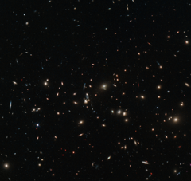

# Preview of potw1338a: "A scattering of spiral and elliptical galaxies"
[https://www.spacetelescope.org/images/potw1338a/](https://www.spacetelescope.org/images/potw1338a/)

This image shows the massive galaxy cluster MACS J0152.5-2852, captured in detail by the NASA/ESA Hubble Space Telescope's Wide Field Camera 3. Almost every object seen here is a galaxy, each containing billions of stars. Galaxies are not usually randomly distributed in space, but instead appear in concentrations of hundreds, held together by their mutual gravity. Elliptical galaxies, like the yellow fuzzy objects seen in the image, are most often found close to the centres of galaxy clusters, while spirals, such as the bluish patches, are usually found to be further out and more isolated. A version of this image obtained tenth prize in the Hubble's Hidden Treasures image processing competition, entered by contestant Judy Schmidt.