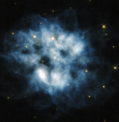

# Preview of potw1339a: "A pulsating stellar relic"
[https://www.spacetelescope.org/images/potw1339a/](https://www.spacetelescope.org/images/potw1339a/)

This NASA/ESA Hubble Space Telescope image shows the planetary nebula NGC 2452, located in the southern constellation of Puppis. The blue haze across the frame is what remains of a star like our Sun after it has depleted all its fuel. When this happens, the core of the star becomes unstable and releases huge numbers of incredibly energetic particles that blow the star's atmosphere away into space. At the centre of this blue cloud lies what remains of the nebula's progenitor star. This cool, dim, and extremely dense star is actually a pulsating white dwarf, meaning that its brightness varies over time as gravity causes waves that pulse throughout the small star's body. NGC 2452 was discovered by Sir John Herschel in 1847. He initially defined it as "an object whose nature I cannot make out. It is certainly not a star, nor a close double star [...] I should call it an oblong planetary nebula". To early observers like Herschel with their smaller telescopes, planetary nebulae resembled gaseous planets, and so were named accordingly. The name has stuck, although modern telescopes like Hubble have made it clear that these objects are not planets at all, but the outer layers of dying stars being thrown off into space. A version of this image was entered into the Hubble's Hidden Treasures image processing competition by contestants Luca Limatola and Budeanu Cosmin Mirel.