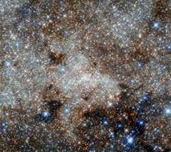

# Preview of potw1340a: "A monster in the Milky Way"
[https://www.spacetelescope.org/images/potw1340a/](https://www.spacetelescope.org/images/potw1340a/)

This image, not unlike a pointillist painting, shows the star-studded centre of the Milky Way towards the constellation of Sagittarius. The crowded centre of our galaxy contains numerous complex and mysterious objects that are usually hidden at optical wavelengths by clouds of dust — but many are visible here in these infrared observations from Hubble. However, the most famous cosmic object in this image still remains invisible: the monster at our galaxy’s heart called Sagittarius A*. Astronomers have observed stars spinning around this supermassive black hole (located right in the centre of the image), and the black hole consuming clouds of dust as it affects its environment with its enormous gravitational pull. Infrared observations can pierce through thick obscuring material to reveal information that is usually hidden to the optical observer. This is the best infrared image of this region ever taken with Hubble, and uses infrared archive data from Hubble’s Wide Field Camera 3, taken in September 2011. It was posted to Flickr by Gabriel Brammer, a fellow at the European Southern Observatory based in Chile. He is also an ESO photo ambassador.