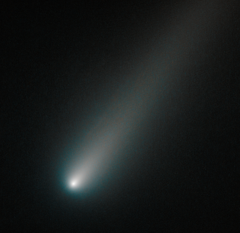

# Preview of potw1342a: "Hubble snaps icy comet ISON"
[https://www.spacetelescope.org/images/potw1342a/](https://www.spacetelescope.org/images/potw1342a/)

This new NASA/ESA Hubble Space Telescope picture shows C/2012 S1, better known as Comet ISON, a high-profile celestial visitor to the Solar System. Hubble has already snapped this comet twice this year (opo1314a, opo1331a), but for some time it was temporarily blocked from view by the Sun. It was spotted again in August 2013, and this new image shows the comet as it appeared in our skies in early October. ISON will be brightest in our skies in late November, just before and after it hurtles past the Sun. As it gets brighter, it may even become visible as a naked eye object, before it fades throughout December — the month of its closest approach to Earth. Depending on its fate as it passes close to the Sun, it could become spectacular or, on the contrary, it could completely disintegrate. Many observatories, as well as several ESA and NASA missions, aim to observe this icy visitor over the coming months. In this Hubble image, taken on 9 October 2013, the comet's solid nucleus is unresolved because it is so small. If it had broken apart — a possibility as the Sun slowly warms it up during its approach — Hubble would have likely seen evidence for multiple fragments instead. Links  NASA release Hubble Heritage release ISONblog, an online source offering analysis of Comet ISON by Hubble Space Telescope astronomers and staff at the Space Telescope Science Institute in Baltimore, USA. 