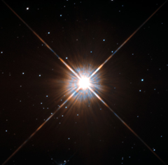

# Preview of potw1343a: "New shot of Proxima Centauri, our nearest neighbour"
[https://www.spacetelescope.org/images/potw1343a/](https://www.spacetelescope.org/images/potw1343a/)

Shining brightly in this Hubble image is our closest stellar neighbour: Proxima Centauri. Proxima Centauri lies in the constellation of Centaurus (The Centaur), just over four light-years from Earth. Although it looks bright through the eye of Hubble, as you might expect from the nearest star to the Solar System, Proxima Centauri is not visible to the naked eye. Its average luminosity is very low, and it is quite small compared to other stars, at only about an eighth of the mass of the Sun. However, on occasion, its brightness increases. Proxima is what is known as a “flare star”, meaning that convection processes within the star’s body make it prone to random and dramatic changes in brightness. The convection processes not only trigger brilliant bursts of starlight but, combined with other factors, mean that Proxima Centauri is in for a very long life. Astronomers predict that this star will remain middle-aged — or a “main sequence” star in astronomical terms — for another four trillion years, some 300 times the age of the current Universe. These observations were taken using Hubble’s Wide Field and Planetary Camera 2 (WFPC2). Proxima Centauri is actually part of a triple star system — its two companions, Alpha Centauri A and B, lie out of frame. Although by cosmic standards it is a close neighbour, Proxima Centauri remains a point-like object even using Hubble’s eagle-eyed vision, hinting at the vast scale of the Universe around us.