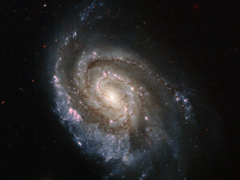

# Preview of potw1344a: "Stellar explosions in NGC 6984"
[https://www.spacetelescope.org/images/potw1344a/](https://www.spacetelescope.org/images/potw1344a/)

Supernovae are intensely bright objects. They are formed when a star reaches the end of its life with a dramatic explosion, expelling most of its material out into space. The subject of this new Hubble image, spiral galaxy NGC 6984, played host to one of these explosions back in 2012, known as SN 2012im. Now, another star has exploded, forming supernova SN 2013ek — visible in this image as the prominent, star-like bright object just slightly above and to the right of the galaxy's centre. SN 2012im is known as a Type Ic supernova, while the more recent SN 2013ek is a Type Ib. Both of these types are caused by the core collapse of massive stars that have shed — or lost — their outer layers of hydrogen. Type Ic supernovae are thought to have lost more of their outer envelope than Type Ib, including a layer of helium. The observations that make up this new image were taken on 19 August 2013, and aimed to pinpoint the location of this new explosion more precisely. It is so close to where SN 2012im was spotted that the two events are thought to be linked; the chance of two completely independent supernovae so close together and of the same class exploding within one year of one another is a very unlikely event. It was initially suggested that SN 2013ek may in fact be SN 2012im flaring up again, but further observations support the idea that they are separate supernovae — although they may be closely related in some as-yet-unknown way.