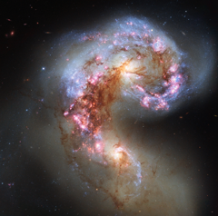

# Preview of potw1345a: "Antennae Galaxies reloaded"
[https://www.spacetelescope.org/images/potw1345a/](https://www.spacetelescope.org/images/potw1345a/)

The NASA/ESA Hubble Space Telescope has snapped the best ever image of the Antennae Galaxies. Hubble has released images of these stunning galaxies twice before, once using observations from its Wide Field and Planetary Camera 2 (WFPC2) in 1997, and again in 2006 from the Advanced Camera for Surveys (ACS). Each of Hubble’s images of the Antennae Galaxies has been better than the last, due to upgrades made during the famous servicing missions, the last of which took place in 2009. The galaxies — also known as NGC 4038 and NGC 4039 — are locked in a deadly embrace. Once normal, sedate spiral galaxies like the Milky Way, the pair have spent the past few hundred million years sparring with one another. This clash is so violent that stars have been ripped from their host galaxies to form a streaming arc between the two. In wide-field images of the pair the reason for their name becomes clear — far-flung stars and streamers of gas stretch out into space, creating long tidal tails reminiscent of antennae. This new image of the Antennae Galaxies shows obvious signs of chaos. Clouds of gas are seen in bright pink and red, surrounding the bright flashes of blue star-forming regions — some of which are partially obscured by dark patches of dust. The rate of star formation is so high that the Antennae Galaxies are said to be in a state of starburst, a period in which all of the gas within the galaxies is being used to form stars. This cannot last forever and neither can the separate galaxies; eventually the nuclei will coalesce, and the galaxies will begin their retirement together as one large elliptical galaxy. This image uses visible and near-infrared observations from Hubble’s Wide Field Camera 3 (WFC3), along with some of the previously-released observations from Hubble’s Advanced Camera for Surveys (ACS).