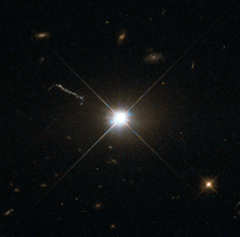

# Preview of potw1346a: "Best image of bright quasar 3C 273"
[https://esahubble.org/images/potw1346a/](https://esahubble.org/images/potw1346a/)

This image from Hubble’s Wide Field and Planetary Camera 2 (WFPC2) is likely the best of ancient and brilliant quasar 3C 273, which resides in a giant elliptical galaxy in the constellation of Virgo (The Virgin). Its light has taken some 2.5 billion years to reach us. Despite this great distance, it is still one of the closest quasars to our home. It was the first quasar ever to be identified, by astronomers Maarten Schmidt and Bev Oke in the early 1960s. The term quasar is an abbreviation of the phrase “quasi-stellar radio source”, as they appear to be star-like on the sky. In fact, quasars are the intensely powerful centres of distant, active galaxies, powered by a huge disc of particles surrounding a supermassive black hole. As material from this disc falls inwards, some quasars — including 3C 273  — have been observed to fire off super-fast jets into the surrounding space. In this picture, one of these jets appears as a cloudy streak, measuring some 200 000 light-years in length. Quasars are capable of emitting hundreds or even thousands of times the entire energy output of our galaxy, making them some of the most luminous and energetic objects in the entire Universe. Of these very bright objects, 3C 273 is the brightest in our skies. If it was located 30 light-years from our own planet — roughly seven times the distance between Earth and Proxima Centauri, the nearest star to us after the Sun — it would still appear as bright as the Sun in the sky.   WFPC2 was installed on Hubble during shuttle mission STS-61. It is the size of a small piano and was capable of seeing images in the visible, near-ultraviolet, and near-infrared parts of the spectrum. Editor's note (July 2024): This text was updated to correct an attribution.