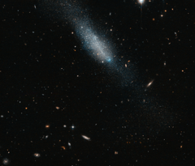

# Preview of potw1347a: "Blue and gold"
[https://www.spacetelescope.org/images/potw1347a/](https://www.spacetelescope.org/images/potw1347a/)

This sprinkling of cosmic glitter makes up the galaxy known as ESO 149-3, located some 20 million light-years away from us. It is an example of an irregular galaxy, characterised by its amorphous, undefined shape — a property that sets it apart from its perhaps more photogenic spiral and elliptical relatives. Around one quarter of all galaxies are thought to be irregular-type galaxies. In this image taken with the NASA/ESA Hubble Space Telescope ESO 149-3 can be seen as a smattering of golden and blue stars, with no apparent central nucleus or arm structure. The surrounding sky is rich in other more distant galaxies, visible as small, colourful streaks and dashes. A version of this image was submitted to the Hubble's Hidden Treasures image processing competition by contestant Luca Limatola.