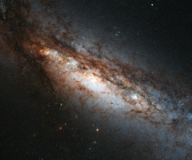

# Preview of potw1348a: "A bizarre cosmic rarity: NGC 660"
[https://www.spacetelescope.org/images/potw1348a/](https://www.spacetelescope.org/images/potw1348a/)

This new Hubble image shows a peculiar galaxy known as NGC 660, located around 45 million light-years away from us. NGC 660 is classified as a "polar ring galaxy", meaning that it has a belt of gas and stars around its centre that it ripped from a near neighbour during a clash about one billion years ago. The first polar ring galaxy was observed in 1978 and only around a dozen more have been discovered since then, making them something of a cosmic rarity. Unfortunately, NGC 660’s polar ring cannot be seen in this image, but has plenty of other features that make it of interest to astronomers – its central bulge is strangely off-kilter and, perhaps more intriguingly, it is thought to harbour exceptionally large amounts of dark matter. In addition, in late 2012 astronomers observed a massive outburst emanating from NGC 660 that was around ten times as bright as a supernova explosion. This burst was thought to be caused by a massive jet shooting out of the supermassive black hole at the centre of the galaxy. A version of this image was entered into the Hubble's Hidden Treasures image processing competition by contestant Brian Campbell.