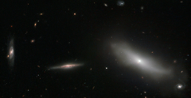

# Preview of potw1349a: "A members-only galaxy club"
[https://www.spacetelescope.org/images/potw1349a/](https://www.spacetelescope.org/images/potw1349a/)

This new Hubble image shows a handful of galaxies in the constellation of Eridanus (The River). NGC 1190, shown here on the right of the frame, stands apart from the rest; it belong to an exclusive club known as Hickson Compact Group 22 (HCG 22). There are four other members of this group, all of which lie out of frame: NGC 1189, NGC 1191, NGC  1192, and NGC 1199. The other galaxies shown here are nearby  galaxies 2MASS J03032308-1539079 (centre), and dCAZ94 HCG 22-21 (left), both of which are  not part of HCG 22. Hickson Compact Groups are incredibly tightly bound groups of galaxies. Their discoverer Paul Hickson observed only 100 of these objects, which he described in his HCG catalogue in the 1980s. To earn the Hickson Compact Group label, there must be at least four members — each one fairly bright and compact. These short-lived groups are thought to end their lives as giant elliptical galaxies, but despite knowing much about their form and destiny, the role of compact galaxy groups in galactic formation and evolution is still unclear. These groups are interesting partly for their self-destructive tendencies. The group members interact, circling and pulling at one another until they eventually merge together, signalling the death of the group, and the birth of a large galaxy. A version of this image was entered into the Hubble's Hidden Treasures image processing competition by contestant Luca Limatola.