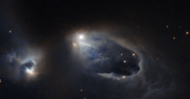

# Preview of potw1350a: "A stellar sneezing fit"
[https://www.spacetelescope.org/images/potw1350a/](https://www.spacetelescope.org/images/potw1350a/)

Look at the bright star in the middle of this image. Achoo! It has just sneezed. This sight will only last for a few thousand years — a blink of an eye in the young star's life. If you could carry on watching for a few years you would realise it's not just one sneeze, but a sneezing fit. This young star is firing off salvos of super-hot, super-fast gas — Achoo! Achoo! — before it finally exhausts itself. These bursts of gas have shaped the turbulent surroundings, creating structures known as Herbig-Haro objects. These objects are formed from the star's energetic "sneezes". These salvos can contain as much mass as our home planet, and cannon into nearby clouds of gas at hundreds of kilometres per second. Shock waves form, such as the U-shape below this star. Unlike most other astronomical phenomena, as the waves crash outwards, they can be seen moving across human timescales. Soon, this star will stop sneezing, and grow up to be a star like the Sun. This region is actually home to several interesting objects. The star at the centre of the frame is a variable star named V633 Cassiopeiae, with Herbig-Haro objects HH 161 and HH 164 forming parts of the horseshoe-shaped loop emanating from it. The slightly shrouded star just to the left is known as V376 Cassiopeiae, another variable star that has succumbed to its neighbour's infectious sneezing fits; this star is also sneezing, creating yet another Herbig-Haro object — HH 162. Both stars are very young and are still surrounded by dusty material left over from their formation, which spans the gap between the two A version of this image was entered into the Hubble's Hidden Treasures image processing competition by contestant Gilles Chapdelaine. For more information about these objects, see Hubblecast 49: Supersonic jets from newborn stars.