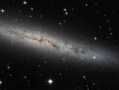

# Preview of potw1351a: "Flat as a pancake"
[https://www.spacetelescope.org/images/potw1351a/](https://www.spacetelescope.org/images/potw1351a/)

Located some 25 million light-years away, this new Hubble image shows spiral galaxy ESO 373-8. Together with at least seven of its galactic neighbours, this galaxy is a member of the NGC 2997 group. We see it side-on as a thin, glittering streak across the sky, with all its contents neatly aligned in the same plane. We see so many galaxies like this — flat, stretched-out pancakes — that our brains barely process their shape. But let us stop and ask: Why are galaxies stretched out and aligned like this? Try spinning around in your chair with your legs and arms out. Slowly pull your legs and arms inwards, and tuck them in against your body. Notice anything? You should have started spinning faster. This effect is due to conservation of angular momentum, and it’s true for galaxies, too. This galaxy began life as a humungous ball of slowly rotating gas. Collapsing in upon itself, it spun faster and faster until, like pizza dough spinning and stretching in the air, a disc started to form. Anything that bobbed up and down through this disc was pulled back in line with this motion, creating a streamlined shape. Angular momentum is always conserved — from a spinning galactic disc 25 million light-years away from us, to any astronomer, or astronomer-wannabe, spinning in his office chair.