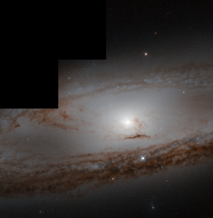

# Preview of potw1352a: "Messier 65 through the years"
[https://www.spacetelescope.org/images/potw1352a/](https://www.spacetelescope.org/images/potw1352a/)

The 1st of March 1780 was a particularly productive night for Charles Messier. Combing the constellation of Leo for additions to his grand astronomical catalogue, he struck on not one, but two, new objects. One of those objects is seen here: Messier 65. "Nebula discovered in Leo: It is very faint and contains no star," he jotted down in his notebook. But he was wrong — as we now know, Messier 65 is a spiral galaxy containing billions upon billions of stars. All Messier saw was a faint diffuse light, nothing like the fine detail here, so we can forgive his mistake. If he had had access to a telescope like Hubble, he could have spied these stunning, tightly wound purple spiral arms and dark dust lanes, encircling a bright centre crammed with stars. Almost exactly 233 years later in March of this year, one of the stars within Messier 65 went supernova (not seen in this image), rivalling the rest of the entire galaxy in brightness. This, the first Messier supernova of 2013, is now fading, and the serene beauty of M65 is returning.