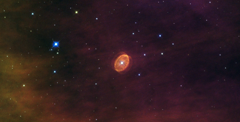

# Preview of potw1401a: "A star set to explode"
[https://www.spacetelescope.org/images/potw1401a/](https://www.spacetelescope.org/images/potw1401a/)

Floating at the centre of this new Hubble image is a lidless purple eye, staring back at us through space. This ethereal object, known officially as [SBW2007] 1 but sometimes nicknamed SBW1, is a nebula with a giant star at its centre. The star was originally twenty times more massive than our Sun, and is now encased in a swirling ring of purple gas, the remains of the distant era when it cast off its outer layers via violent pulsations and winds. But the star is not just any star; scientists say that it is destined to go supernova! 26 years ago, another star with striking similarities went supernova — SN 1987A. Early Hubble images of SN 1987A show eerie similarities to SBW1. Both stars had identical rings of the same size and age, which were travelling at similar speeds; both were located in similar HII regions; and they had the same brightness. In this way SBW1 is a snapshot of SN1987a's appearance before it exploded, and unsurprisingly, astronomers love studying them together. At a distance of more than 20 000 light-years it will be safe to watch when the supernova goes off. If we are very lucky it may happen in our own lifetimes... Versions of this image were entered into the Hubble's Hidden Treasures image processing competition by contestants Nick Rose and Steve Byrne. Links  Paper on SBW1 by Nathan Smith et al. 