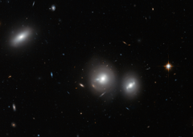

# Preview of potw1402a: "Hubble close-up on the Coma Cluster"
[https://www.spacetelescope.org/images/potw1402a/](https://www.spacetelescope.org/images/potw1402a/)

In this new image Hubble peeks into the Coma Cluster, a massive gathering of galaxies located towards the constellation of Coma Berenices. This large cluster is around 350 million light-years away from us and contains over 1000 identified galaxies, the majority of which are elliptical. The bright, saucer-shaped objects surrounded by misty halos in this image are galaxies, each of them host to many millions of stars. The background of the image is full of distant galaxies, many of them with spiral shapes, that are located much further away and do not belong to the cluster. Visible in this image are three galaxies within the Coma Cluster: IC 4041 (far left), IC 4042 (centre), and GP 236 (right). A version of this image was entered into the Hidden Treasures image processing competition by contestant Nick Rose. Links  Hubble's sweeping view of the Coma cluster Wide-field view of the Coma cluster (ground-based image) 