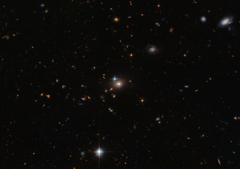

# Preview of potw1403a: "Seeing double"
[https://www.spacetelescope.org/images/potw1403a/](https://www.spacetelescope.org/images/potw1403a/)

In this new Hubble image two objects are clearly visible, shining brightly. When they were first discovered in 1979, they were thought to be separate objects — however, astronomers soon realised that these twins are a little too identical! They are close together, lie at the same distance from us, and have surprisingly similar properties. The reason they are so similar is not some bizarre coincidence; they are in fact the same object. These cosmic doppelgangers make up a double quasar known as QSO 0957+561, also known as the "Twin Quasar", which lies just under 14 billion light-years from Earth. Quasars are the intensely powerful centres of distant galaxies. So, why are we seeing this quasar twice? Some 4 billion light-years from Earth — and directly in our line of sight — is the huge galaxy YGKOW G1. This galaxy was the first ever observed gravitational lens, an object with a mass so great that it can bend the light from objects lying behind it. This phenomenon not only allows us to see objects that would otherwise be too remote, in cases like this it also allows us to see them twice over. Along with the cluster of galaxies in which it resides, YGKOW G1 exerts an enormous gravitational force. This doesn't just affect the galaxy's shape, the stars that it forms, and the objects around it — it affects the very space it sits in, warping and bending the environment and producing bizarre effects, such as this quasar double image. This observation of gravitational lensing, the first of its kind, meant more than just the discovery of an impressive optical illusion allowing telescopes like Hubble to effectively see behind an intervening galaxy. It was evidence for Einstein's theory of general relativity. This theory had identified gravitational lensing as one of its only observable effects, but until this observation no such lensing had been observed since the idea was first mooted in 1936. Links:  ESA/Hubble release: Gravitational telescope creates space invader mirage ESA/Hubble release: Lenses galore — Hubble finds large sample of very distant galaxies ESA/Hubble release: Hubble finds double Einstein ring 