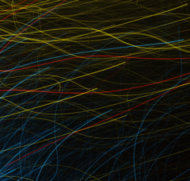

# Preview of potw1404a: "Hubble’s modern art"
[https://www.spacetelescope.org/images/potw1404a/](https://www.spacetelescope.org/images/potw1404a/)

A piece of art? A time-lapse photo? A flickering light show? At first glance, this image looks nothing like the images that we are used to seeing from Hubble. The distinctive splashes of colour must surely be a piece of modern art, or an example of the photographic technique of "light painting". Or, could they be the trademark tracks of electrically charged particles in a bubble chamber? On a space theme, how about a time-lapse of the paths of orbiting satellites? The answer? None of the above. In fact, this is a genuine frame that Hubble relayed back from an observing session. Hubble uses a Fine Guidance System (FGS) in order to maintain stability whilst performing observations. A set of gyroscopes measures the attitude of the telescope, which is then corrected by a set of reaction wheels. In order to compensate for gyroscopic drift, the FGS locks onto a fixed point in space, which is referred to as a guide star. It is suspected that in this case, Hubble had locked onto a bad guide star, potentially a double star or binary. This caused an error in the tracking system, resulting in this remarkable picture of brightly coloured stellar streaks. The prominent red streaks are from stars in the globular cluster NGC 288. It seems that even when Hubble makes a mistake, it can still kick-start our imagination. A version of this image was entered into the Hubble's Hidden Treasures image processing competition by contestant Judy Schmidt.