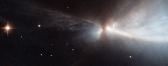

# Preview of potw1405a: "A nursery for unruly young stars"
[https://www.spacetelescope.org/images/potw1405a/](https://www.spacetelescope.org/images/potw1405a/)

This striking new image, captured by the NASA/ESA Hubble Space Telescope, reveals a star in the process of forming within the Chamaeleon cloud. This young star is throwing off narrow streams of gas from its poles — creating this ethereal object known as HH 909A. These speedy outflows collide with the slower surrounding gas, lighting up the region. When new stars form, they gather material hungrily from the space around them. A young star will continue to feed its huge appetite until it becomes massive enough to trigger nuclear fusion reactions in its core, which light the star up brightly. Before this happens, new stars undergo a phase during which they violently throw bursts of material out into space. This material is ejected as narrow jets that streak away into space at breakneck speeds of hundreds of kilometres per second, colliding with nearby gas and dust and lighting up the region. The resulting narrow, patchy regions of faintly glowing nebulosity are known as Herbig-Haro objects. They are very short-lived structures, and can be seen to visibly change and evolve over a matter of years (heic1113) — just the blink of an eye on astronomical timescales. These structures are very common within star-forming regions like the Orion Nebula, or the Chameleon I molecular cloud — home to the subject of this image. The Chameleon cloud is located in the southern constellation of Chameleon, just over 500 light-years from Earth. Astronomers have found numerous Herbig-Haro objects embedded in this stellar nursery, most of them emanating from stars with masses similar to that of the Sun. A few are thought to be tied to less massive objects such as brown dwarfs, which are "failed" stars that did not hit the critical mass to spark reactions in their centres. A version of this image was entered into the Hubble's Hidden Treasures image processing competition by contestant Judy Schmidt.