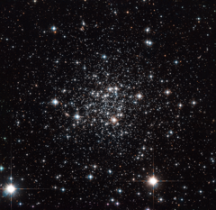

# Preview of potw1406a: "It came from outer space"
[https://www.spacetelescope.org/images/potw1406a/](https://www.spacetelescope.org/images/potw1406a/)

Named after its discoverer, the French-Armenian astronomer Agop Terzan, this is the globular cluster Terzan 7 — a densely packed ball of stars bound together by gravity. It lies just over 75 000 light-years away from us on the other side of our galaxy, the Milky Way. It is a peculiar cluster, quite unlike others we observe, making it an intriguing object of study for astronomers. Evidence shows that Terzan 7 used to belong to a small galaxy called the Sagittarius Dwarf Galaxy, a mini-galaxy discovered in 1994. This galaxy is currently colliding with, and being absorbed by, the Milky Way, which is a monster in size when compared to this tiny one. It seems that this cluster has already been kidnapped from its former home and now is part of our own galaxy. Astronomers recently discovered that all the stars in Terzan 7 were born at around the same time, and are about eight billion years old. This is unusually young for such a cluster. The shared birthday is another uncommon property; a large number of globular clusters, both in the Milky Way and in other galaxies, seem to have at least two clearly differentiated generations of stars that were born at different times. Some explanations suggest that there is something different about clusters that form within dwarf galaxies, giving them a different composition. Others suggest that clusters like Terzan 7 only have enough material to form one batch of stars, or that perhaps its youthfulness has prevented it from yet forming another generation. A version of this image was entered into the Hubble's Hidden Treasures image processing competition by contestant Gilles Chapdelaine.