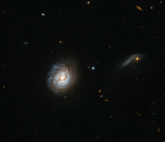

# Preview of potw1407a: "Starbursts versus monsters"
[https://www.spacetelescope.org/images/potw1407a/](https://www.spacetelescope.org/images/potw1407a/)

The dominating figure in the middle of this new Hubble image is a galaxy known as MCG-03-04-014. It belongs to a class of galaxies called luminous infrared galaxies — galaxies that are incredibly bright in the infrared part of the spectrum. This galaxy's status as a luminous infrared galaxy makes it part of an interesting astronomical question: starbursts versus monsters, a debate over how these galaxies are powered. Why are they so luminous in the infrared? Is it due to a recent burst of star formation, or a fiercely powerful "monster" black hole lurking at their core — or a mix of the two? The answer is still unclear. This new image of MCG-03-04-014 shows bright sparks of star formation dotted throughout the galaxy, with murky dust lanes obscuring a bright central bulge. The galaxy seems to show evidence of disruption; at the top of the galaxy you can see bright wisps streaking into space, but the bottom is smooth and rounded. This asymmetrical appearance implies that another object is tugging at the galaxy and distorting its symmetry. A version of this image was entered into the Hubble's Hidden Treasures image processing competition by contestant Judy Schmidt. Links  The Great Observatory All-sky LIRG Survey (GOALS) 