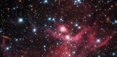

# Preview of potw1408a: "Cloaked in red"
[https://www.spacetelescope.org/images/potw1408a/](https://www.spacetelescope.org/images/potw1408a/)

This stunning new Hubble image shows a small part of the Large Magellanic Cloud, one of the closest galaxies to our own. This collection of small baby stars, most weighing less than the Sun, form a young stellar cluster known as LH63. This cluster is still half-embedded in the cloud from which it was born, in a bright star-forming region known as the emission nebula LHA 120-N 51, or N51. This is just one of the hundreds of star-forming regions filled with young stars spread throughout the Large Magellanic Cloud. The burning red intensity of the nebulae at the bottom of the picture illuminates wisps of gas and dark dust, each spanning many light-years. Moving up and across, bright stars become visible as sparse specks of light, giving the impression of pin-pricks in a cosmic cloak. This patch of sky was the subject of observation by Hubble's WFPC2 camera. Looking for and at low-mass stars can help us to understand how stars behave when they are in the early stages of formation, and can give us an idea of how the Sun might have looked billions of years ago. A version of this image was submitted to the Hubble's Hidden Treasures image processing competition by contestant Luca Limatola.