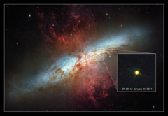

# Preview of potw1409a: "Hubble views new supernova in Messier 82"
[https://esahubble.org/images/potw1409a/](https://esahubble.org/images/potw1409a/)

Spiral galaxy Messier 82 has long been known for its remarkable starburst activity, caused by interactions with its near neighbour Messier 81, and has been the subject of intense study for many years. On 21 January 2014, astronomers at the University of London Observatory in London, UK, pointed their telescope at the galaxy and spied something peculiar… an intensely bright spot seemed to have suddenly appeared within the galaxy [1]. This bright spot is actually a new supernova known as SN 2014J — the closest supernova to Earth in recent decades! Since its discovery, SN 2014J has been confirmed as a type Ia supernova, making it the closest of its type to Earth in over 40 years (since SN 1972E) [2]. This new NASA/ESA Hubble Space Telescope image is set against a previous mosaic of Messier 82 from 2006 (heic0604a), and shows the supernova as an intensely bright spot towards the bottom right of the frame. Type Ia supernovae are even more exciting for astronomers, as they have particular properties that we can use to probe the distant Universe. They are used as standard candles to measure distances and help us understand the scale of the cosmos. Catching such a supernova so soon after its explosion is very unusual; this early discovery will enable astronomers to explore its evolution in great detail, and to potentially infer the properties of its progenitor star. Messier 82 is several times more luminous than our Milky Way. Because it is only 12 million light-years away, it is one of the brighter galaxies in the northern sky. It can be found in the constellation of Ursa Major (The Great Bear). The supernova is currently visible through a modest amateur telescope, so why not see if you can spot it from your back garden? The image shown here was taken on 31 January 2014 with Hubble’s Wide Field Camera 3. This image is inset into a photo mosaic of the entire galaxy taken in 2006 with Hubble’s Advanced Camera for Surveys. Notes [1] The supernova was discovered at 19:20 GMT by a team of students — Ben Cooke, Tom Wright, Matthew Wilde and Guy Pollack — assisted by Dr Steve Fossey. The supernova is visible in pre-discovery images of the galaxy. [2] Supernova SN 1987A, discovered in 1987, was closer to Earth than SN 2014J, but it was a type II supernova rather than a type Ia. Link  University College London announcement of supernova discovery 