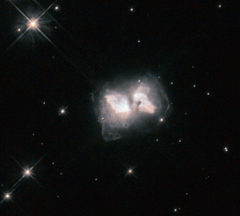

# Preview of potw1410a: "An interstellar butterfly"
[https://www.spacetelescope.org/images/potw1410a/](https://www.spacetelescope.org/images/potw1410a/)

They say the flap of a butterfly's wings can set off a tornado on the other side of the world. But what happens when a butterfly flaps its wings in the depths of space? This cosmic butterfly is a nebula known as AFGL 4104, or Roberts 22. Caused by a star that is nearing the end of its life and has shrugged off its outer layers, the nebula emerges as a cosmic chrysalis to produce this striking sight. Studies of the lobes of Roberts 22 have shown an amazingly complex structure, with countless intersecting loops and filaments. A butterfly's life span is counted in weeks; although on a much longer timescale, this stage of life for Roberts 22 is also transient. It is currently a preplanetary nebula, a short-lived phase that begins once a dying star has pushed much of the material in its outer layers into space, and ends once this stellar remnant becomes hot enough to ionise the surrounding gas clouds and make them glow. About 400 years ago, the star at the centre of Roberts 22 shed its outer shells, which raced outwards to form this butterfly. The central star will soon be hot enough to ionise the surrounding gas, and it will evolve into a fully fledged planetary nebula. Information about the nature, age, and structure of Roberts 22 was presented in a paper using Hubble data back in 1999, published in The Astronomical Journal.