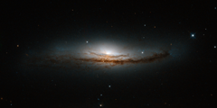

# Preview of potw1411a: "Secrets at the heart of NGC 5793"
[https://www.spacetelescope.org/images/potw1411a/](https://www.spacetelescope.org/images/potw1411a/)

  This new Hubble image is centred on NGC 5793, a spiral galaxy over 150 million light-years away in the constellation of Libra. This galaxy has two particularly striking features: a beautiful dust lane and an intensely bright centre — much brighter than that of our own galaxy, or indeed those of most spiral galaxies we observe. NGC 5793 is a Seyfert galaxy. These galaxies have incredibly luminous centres that are thought to be caused by hungry supermassive black holes — black holes that can be billions of times the size of the Sun — that pull in and devour gas and dust from their surroundings. This galaxy is of great interest to astronomers for many reasons. For one, it appears to house objects known as masers. Whereas lasers emit visible light, masers emit microwave radiation [1]. Naturally occurring masers, like those observed in NGC 5793, can tell us a lot about their environment; we see these kinds of masers in areas where stars are forming. In NGC 5793 there are also intense mega-masers, which are thousands of times more luminous than the Sun. A version of this image was submitted to the Hubble’s Hidden Treasures image processing competition by contestant Judy Schmidt. Notes: [1]  This name originates from the acronym Microwave Amplification by Stimulated Emission of Radiation. Maser emission is caused by particles that absorb energy from their surroundings and then re-emit this in the microwave part of the spectrum.