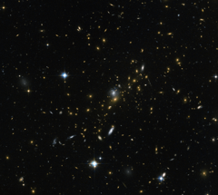

# Preview of potw1412a: "Magnifying the distant Universe"
[https://www.spacetelescope.org/images/potw1412a/](https://www.spacetelescope.org/images/potw1412a/)

Galaxy clusters are some of the most massive structures that can be found in the Universe — large groups of galaxies bound together by gravity. This image from the NASA/ESA Hubble Space Telescope reveals one of these clusters, known as MACS J0454.1-0300. Each of the bright spots seen here is a galaxy, and each is home to many millions, or even billions, of stars. Astronomers have determined the mass of MACS J0454.1-0300 to be around 180 trillion times the mass of the Sun. Clusters like this are so massive that their gravity can even change the behaviour of space around them, bending the path of light as it travels through them, sometimes amplifying it and acting like a cosmic magnifying glass. Thanks to this effect, it is possible to see objects that are so far away from us that they would otherwise be too faint to be detected. In this case, several objects appear to be dramatically elongated and are seen as sweeping arcs to the left of this image. These are galaxies located at vast distances behind the cluster — their image has been amplified, but also distorted, as their light passes through MACS J0454.1-0300. This process, known as gravitational lensing, is an extremely valuable tool for astronomers as they peer at very distant objects. This effect will be put to good use with the start of Hubble's Frontier Fields program over the next few years, which aims to explore very distant objects located behind lensing clusters, similar to MACS J0454.1-0300, to investigate how stars and galaxies formed and evolved in the early Universe. A version of this image was entered into the Hubble's Hidden Treasures image processing competition by contestant Nick Rose.