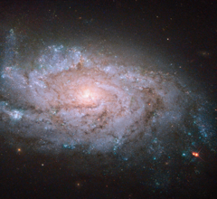

# Preview of potw1413a: "A spiral home to exploding stars"
[https://esahubble.org/images/potw1413a/](https://esahubble.org/images/potw1413a/)

In this new Hubble image, we can see an almost face-on view of the galaxy NGC 1084. At first glance, this galaxy is pretty unoriginal. Like the majority of galaxies that we observe it is a spiral galaxy, and, as with about half of all spirals, it has no bar running through its loosely wound arms. However, although it may seem unremarkable on paper, NGC 1084 is actually a near-perfect example of this type of galaxy — and Hubble has a near-perfect view of it. NGC 1084 has hosted several violent events known as supernovae — explosions that occur when massive stars, many times more massive than the Sun, approach their twilight years. As the fusion processes in their cores run out of fuel and come to an end, these stellar giants collapse, blowing off their outer layers in a violent explosion. Supernovae can often briefly outshine an entire galaxy, before then fading away over several weeks or months. Although directly observing one of these explosions is hard to do, in galaxies like NGC 1084 astronomers can find and study the remnants left behind. Astronomers have noted five supernova explosions within NGC 1084 over the past half century. These remnants are named after the year in which they took place — 1963P, 1996an, 1998dl, 2009H, and 2012ec. The most recent explosion, 2012ec, was detected at the end of NGC 1084’s top right arm in August 2012. It is not visible here as these images were taken in 2001, some eleven years before this supernova exploded. Astronomers at Queen's University Belfast have managed to use these "before" images to directly identify the star that exploded. It appears to be a red supergiant some 10 to 20 times more massive than the Sun, and quite similar to the well-known star Betelguese in Orion. A version of this image was entered into the Hubble's Hidden Treasures image processing competition by Flickr user Brian Campbell (Sinickel).